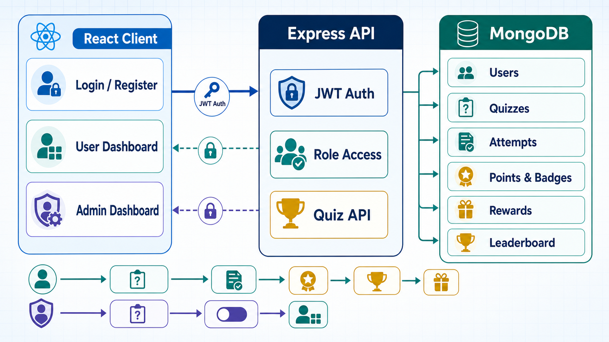
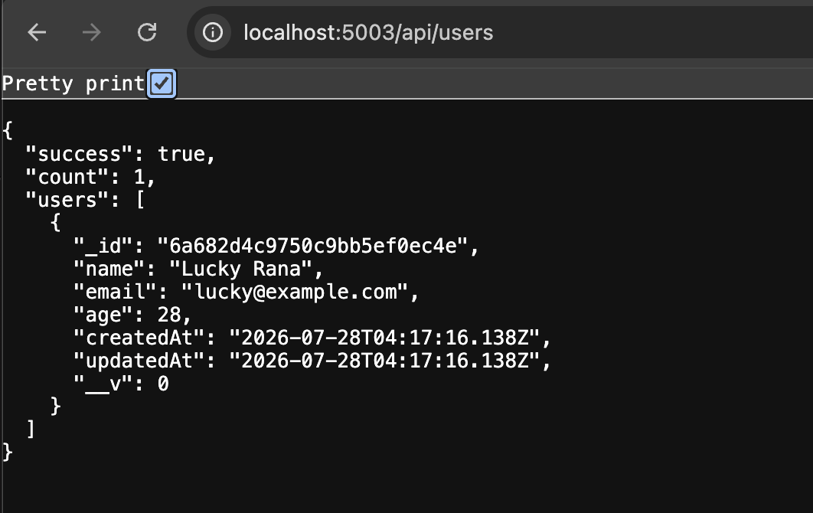
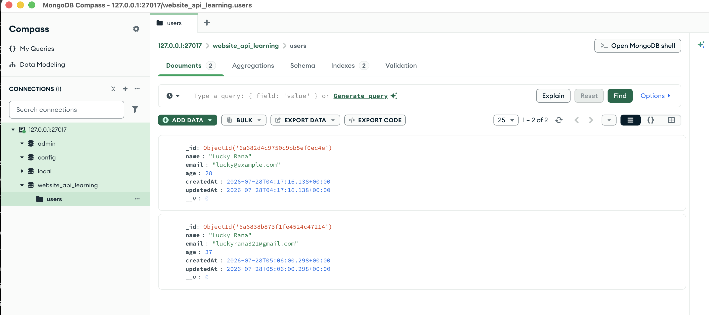
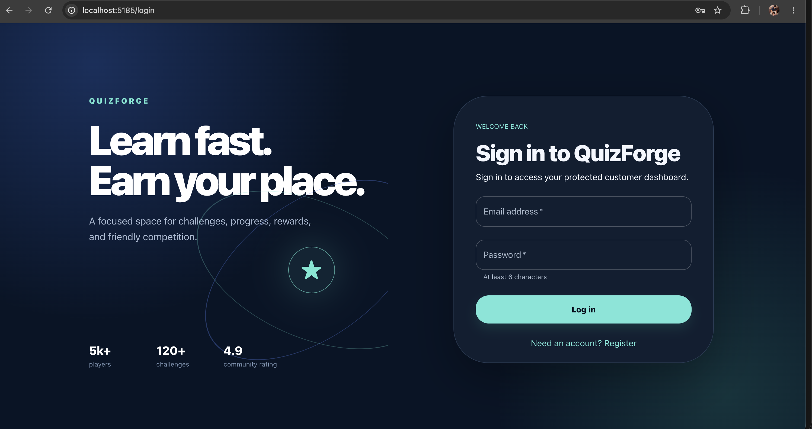
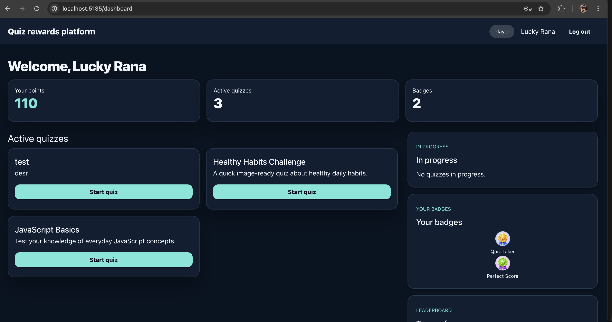
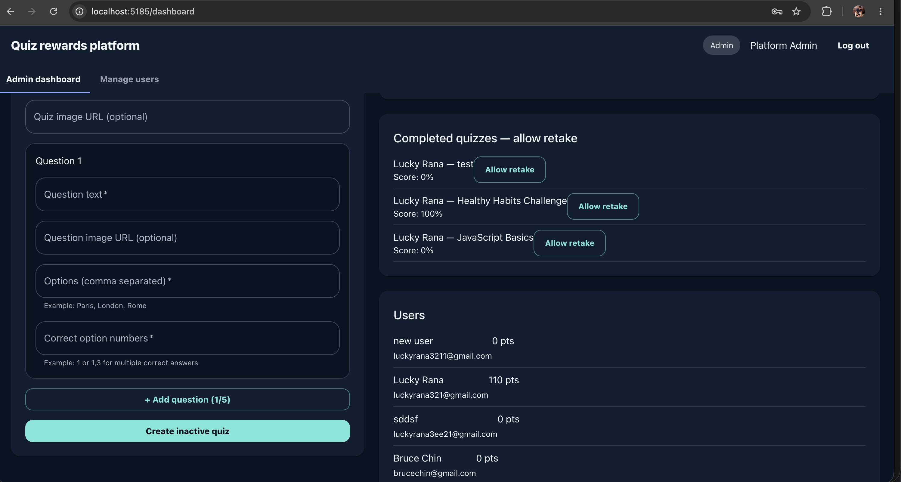

Web-page with login,registration , dashboard with customer Form (Add,Update,Delete Operation through Api)  and Server side API development using jwt token

A learning project containing a React client and an Express/MongoDB API server.

## Local URLs

- API server: [http://127.0.0.1:5003](http://127.0.0.1:5003)
- Users API: [http://127.0.0.1:5003/api/users](http://127.0.0.1:5003/api/users)

## Project Structure

```text
.
├── client/
└── server/
    ├── src/
    │   ├── config/
    │   ├── controllers/
    │   ├── middleware/
    │   ├── models/
    │   ├── repositories/
    │   ├── routes/
    │   ├── services/
    │   └── server.js
    └── package.json
```

## Prerequisites

- Node.js and npm
- MongoDB Community Edition


# Project Workflow


## Server Setup

### Install dependencies

From the project root, run:

```bash
npm install
```

If dependencies have not been installed for the server yet, run:

```bash
cd server
npm install
cd ..
```

### Configure MongoDB

Create `server/.env` with your MongoDB connection string:

```env
MONGODB_URI=mongodb://127.0.0.1:27017/website_api_learning
PORT=5003
JWT_SECRET=replace-this-with-a-long-random-secret
JWT_EXPIRES_IN=1h
ADMIN_EMAIL=admin@example.com
ADMIN_PASSWORD=Admin@12345
```

MongoDB connection details:

- `127.0.0.1` is your local computer.
- `27017` is MongoDB’s default port.
- `website_api_learning` is the database name.

### Install MongoDB with Homebrew

Check that Homebrew is installed:

```bash
brew --version
```

Install and start MongoDB Community Edition:

```bash
brew tap mongodb/brew
brew install mongodb-community
brew services start mongodb-community
```

### Start the server

From the project root:

```bash
npm run dev
```

The server should be available at [http://127.0.0.1:5003](http://127.0.0.1:5003).

### Seed demo data

After MongoDB is running, create the demo admin, active quizzes, reward, and mission:

```bash
cd server
npm run seed
```

The seeded admin can create quizzes and activate/deactivate them. Normal users can only access their own dashboard, active quizzes, points, badges, rewards, and leaderboard.

## Users API

### Authentication

Register or log in to receive a JWT access token. Keep `server/.env` private and use a long random value for `JWT_SECRET`.

```bash
curl -X POST http://127.0.0.1:5003/api/auth/register \
  -H "Content-Type: application/json" \
  -d '{
    "name": "Lucky Rana",
    "email": "lucky@example.com",
    "password": "secret123"
  }'
```

Use the returned token on the users API:

```bash
curl http://127.0.0.1:5003/api/users \
  -H "Authorization: Bearer YOUR_TOKEN"
```

Login uses `POST /api/auth/login` with `email` and `password`. All `/api/users` endpoints require this bearer token.

### Get all users

Open [http://127.0.0.1:5003/api/users](http://127.0.0.1:5003/api/users) in a browser or run:

```bash
curl http://127.0.0.1:5003/api/users \
  -H "Authorization: Bearer YOUR_TOKEN"
```

Example response:

```json
{
  "success": true,
  "count": 0,
  "users": []
}
```

### Create a user

```bash
curl -X POST http://127.0.0.1:5003/api/users \
  -H "Content-Type: application/json" \
  -d '{
    "name": "Lucky Rana",
    "email": "lucky@example.com",
    "age": 28
  }'
```

Example response:

```json
{
  "success": true,
  "message": "User created successfully",
  "user": {
    "_id": "...",
    "name": "Lucky Rana",
    "email": "lucky@example.com",
    "age": 28
  }
}
```

## Run the Client and Server

Start the server with `npm run dev`, then start the client from the `client` directory using its development script:

```bash
cd client
npm run dev
```

After both applications are running, open the client URL shown in the terminal.



# Mongo Db Compass View



# Login / Registration

Anyone can do login and create user by Register page



# Customer Dashboard



# Admin Dashboard

User Name - admin@example.com

password - Admin@12345




## Troubleshooting

If the server is already running or port `5003` is in use, find the process listening on the port:

```bash
lsof -nP -iTCP:5003 -sTCP:LISTEN
```

Stop the process using its PID:

```bash
kill <PID>
```

If necessary, force-stop it:

```bash
kill -9 <PID>
```

You can also stop server processes started with Node or Nodemon:

```bash
sudo pkill -f "nodemon src/server.js"
sudo pkill -f "node src/server.js"
```
