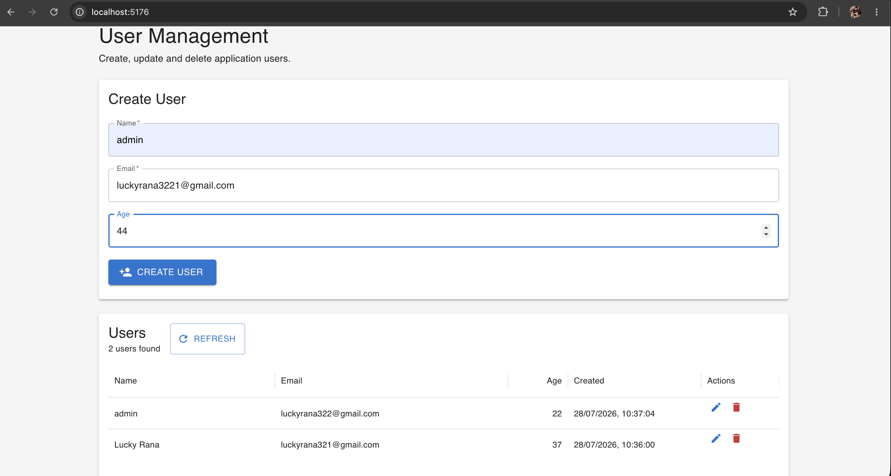

Website And Server Api Learning

http://localhost:5000
http://127.0.0.1:5000

# create directories

mkdir controller
mkdir users

# create files touch command

touch src/controllers/userController.js

# all together touch command

touch .env
src/app.js
src/server.js
src/routes/userRoutes.js
src/controllers/userController.js
src/models/User.js
src/config/database.js


# User Api end point

http://localhost:5003/api/users

**Mongo Db Config:**

* `127.0.0.1` = your own computer ip address
* `27017` = MongoDB's default port
* `website_api_learning` = database name

# Install Local computer Mongo Db using Homebrew

brew **--version**

# the MongoDB Homebrew repository

brew tap mongodb/brew

# Install MongoDB Community Edition

brew install mongodb-community

# After installation, start MongoDB:

brew services start mongodb-community

# Start Server again

npm run dev

# Open below url in chrome browser

http://localhost:5003/api/users

Response:

```
{
  "success": true,
  "count": 0,
  "users": []
}
```

# To add new user , run this curl command in terminal

```
curl -X POST http://localhost:5003/api/users -H "Content-Type: application/json" -d '{
  "name": "Lucky Rana",
  "email": "lucky@example.com",
  "age": 28
}'
```

#Response

```
{
  "success": true,
  "message": "User created successfully",
  "user": {
    "_id": "...",
    "name": "Lucky Rana",
    "email": "lucky@example.com",
    "age": 28
  }
}
```

# Open / Refresh Api url again in chrome browser


# run both Client and Server and you will get below result:




Server already running issue debugging and kill all open port PID


# Search running server and kill PID

lsof -nP -iTCP:5003 -sTCP:LISTEN

# kill server

kill 86508

kill -9 86508

sudo pkill -f "nodemon src/server.js"
sudo pkill -f "node src/server.js"

Test api is available:

**curl**"http://127.0.0.1:5003/api/users"

<pre class="overflow-visible! px-0!" data-start="290" data-end="463"><div class="relative w-full mt-4 mb-1"><div class=""><div class="contents"><div class="border border-token-border-light border-radius-3xl corner-superellipse/1.1 rounded-3xl"><div class="relative h-full w-full border-radius-3xl bg-(--code-block-surface) corner-superellipse/1.1 overflow-clip rounded-3xl [--code-block-surface:var(--bg-elevated-secondary)] dark:[--code-block-surface:var(--composer-surface-primary)] lxnfua_clipPathFallback"><div class="pointer-events-none absolute inset-x-4 top-12 bottom-4"><div class="pointer-events-none sticky z-40 shrink-0 z-1!"><div class="sticky bg-token-border-light"></div></div></div></div></div></div></div></div></pre>
